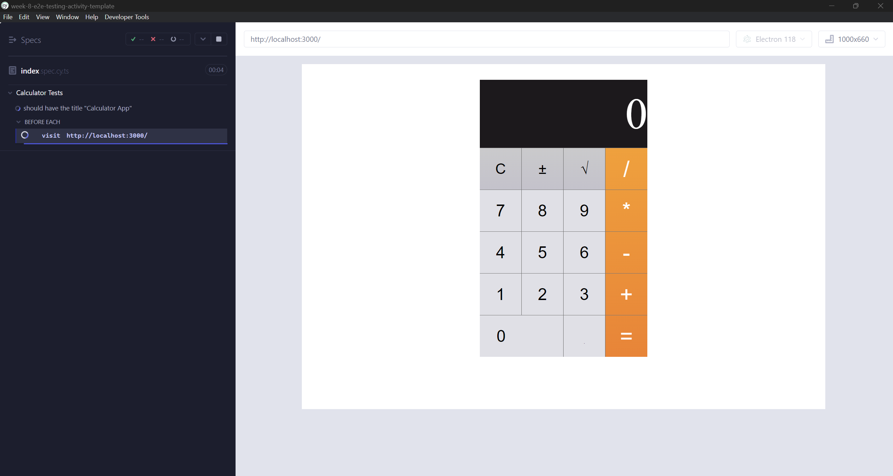

# Week 8 End-To-End Testing Activity

In this activity, we will write some end-to-end tests for our Calculator App using Cypress.
By now, we are familiar with Jest, which is a JavaScript testing framework.
[Cypress](https://docs.cypress.io/app/get-started/why-cypress) is a UI testing framework that also does end-to-end tests.

## The Task

The task for today is to write 10 meaningful end-to-end tests to validate the happy path test scenarios for our calculator.

## Making sure the starter code works

First, we need to install all the necessary dependencies.
 - Run `npm install` in the project root.
To run the end-to-end tests, run the following command:
 - Run `npm run e2e`
This should start a dev server, open an electron app, and display the calculator we have implemented using React.
The browser should then close automatically.

It should look something like this:


## About The Code

You will write your tests in `cypress/e2e/index.spec.cy.ts`.
We already have a basic code written in there.

*Note:* We will NOT be working in the `src` directory during this activity.

### Understanding The Setup

Cypress uses Mocha under the hood, which is similar to Jest in many ways but slightly different.

```typescript

describe('Calculator Tests', () => {

  beforeEach(() => {
    cy.visit('http://localhost:3000/');
  });
  
  it('should have the title "Calculator App"', () => {
    cy.get('title').should('have.text', 'Calculator App');
  });

});

```

Mocha provides us with 2 setup (before and beforeEach) and 2 teardown (after and afterEach) functions.

- `beforeEach`: The beforeEach function executes before every test defined by the `it` or `test` function.
  - In this case, we invoke the `cy.visit()` method in beforeEach which will navigate to `localhost:3000` before every test giving us a fresh instance of the calculator for each test.
  - *Important:* Tests should be isolated and hermatic.

Understanding the Test

- The test invokes `cy.get()` which gets an element from the dom.
  - In this case, we are fetching the title.
- The `get` method is chained with `should` which asserts some property.
  - We are asserting that the `title` should have the text `Calculator App`.  


### Writing Your First Test

Let us write a test to verify that clicking "1 + 1 = " produces the result "2". 
As always, we divide our tests into 3 parts (Assemble, Act, Assert).

The set-up is clicking on the keys "1", "+", and "1".
In order to do this, we will invoke `cy.get()` to get a reference to the desired html element and invoke `click()` on it.

We can select html elements using the classnames shown below:
```typescript
<div className="function-keys">
  <CalculatorKey className="key-clear" label={ActionKeys.CLEAR} onPress={actionKeyPressHandler} />
  <CalculatorKey className="key-sign" label={ActionKeys.SIGN_FLIP} onPress={actionKeyPressHandler} />
  <CalculatorKey className="key-percent" label={OperatorKeys.SQRT} onPress={operatorKeyPressHandler} />
</div>
<div className="digit-keys">
  <CalculatorKey className="key-0" label={NumericKeys.ZERO} onPress={numericKeyPressHandler} />
  <CalculatorKey className="key-dot" label={ActionKeys.DOT} onPress={actionKeyPressHandler} />
  <CalculatorKey className="key-1" label={NumericKeys.ONE} onPress={numericKeyPressHandler} />
  <CalculatorKey className="key-2" label={NumericKeys.TWO} onPress={numericKeyPressHandler} />
  <CalculatorKey className="key-3" label={NumericKeys.THREE} onPress={numericKeyPressHandler} />
  <CalculatorKey className="key-4" label={NumericKeys.FOUR} onPress={numericKeyPressHandler} />
  <CalculatorKey className="key-5" label={NumericKeys.FIVE} onPress={numericKeyPressHandler} />
  <CalculatorKey className="key-6" label={NumericKeys.SIX} onPress={numericKeyPressHandler} />
  <CalculatorKey className="key-7" label={NumericKeys.SEVEN} onPress={numericKeyPressHandler} />
  <CalculatorKey className="key-8" label={NumericKeys.EIGHT} onPress={numericKeyPressHandler} />
  <CalculatorKey className="key-9" label={NumericKeys.NINE} onPress={numericKeyPressHandler} />
</div>
<div className="operator-keys">
  <CalculatorKey className="key-divide" label={OperatorKeys.DIV} onPress={operatorKeyPressHandler} />
  <CalculatorKey className="key-multiply" label={OperatorKeys.MULT} onPress={operatorKeyPressHandler} />
  <CalculatorKey className="key-subtract" label={OperatorKeys.MINUS} onPress={operatorKeyPressHandler} />
  <CalculatorKey className="key-add" label={OperatorKeys.PLUS} onPress={operatorKeyPressHandler} />
  <CalculatorKey className="key-equals" label={ActionKeys.EQUALS} onPress={actionKeyPressHandler} />
</div>
```

Thus, to select the key "1", we can invoke `cy.get('.key-1')`.
Let us start writing our test below the existing test:

```typescript
it('should have the title "Calculator App"', () => {
  cy.get('title').should('have.text', 'Calculator App');
});

it('should display 2 when "1 + 1 = " is clicked', () => {

  // Assemble
  cy.get('.key-1').click();
  cy.get('.key-add').click();
  cy.get('.key-1').click();

});
```

Next, we need to click on equals:

```typescript
it('should display 2 when "1 + 1 = " is clicked', () => {

  // Assemble
  cy.get('.key-1').click();
  cy.get('.key-add').click();
  cy.get('.key-1').click();

  // Act
  cy.get('.key-equals').click();

});
```

Finally, we need to verify that the display has changed to "2":

```typescript
it('should display 2 when "1 + 1 = " is clicked', () => {

  // Assemble
  cy.get('.key-1').click();
  cy.get('.key-add').click();
  cy.get('.key-1').click();

  // Act
  cy.get('.key-equals').click();

  // Assert
  cy.get('.calculator-display').should('have.text', '2');

});
```

The `index.spec.cy.ts` file should now look as follows:

```typescript

describe('Calculator Tests', () => {

  beforeEach(() => {
    cy.visit('http://localhost:3000/');
  });
  
  it('should have the title "Calculator App"', () => {
    cy.get('title').should('have.text', 'Calculator App');
  });

  it('should display 2 when "1 + 1 = " is clicked', () => {

    cy.get('.key-1').click();
    cy.get('.key-add').click();
    cy.get('.key-1').click();
    cy.get('.key-equals').click();

    cy.get('.calculator-display').should('have.text', '2');

  });

});

```

## Running the Test
- To run the test, simply run the command `npm run e2e`.
- You may notice that this is actually quite slow.
  - If you do not need to see the tests running, you can run them in headless mode (which will also get rid of the 500ms delay we have added for each key press)
  - Run the command `npm run e2e:headless`.
- You can also see your grade in your terminal:
  - ```
      New tests added: 2/10
      Grade: 20/100
    ```

## Next Steps

Write 8 more end-to-end tests to get full credit!

## Submission

In the root directory, run the command `npm run zip`. 
This command will generate a zip file called `submission.zip`.
Upload the `submission.zip` file to Gradescope and tag your partner on Gradescope on the submission.

## Grading

The submission must contain a total of 10 e2e tests to receive full credit.
The starter contains 1 test and we walk through 1 test in the instructions, so you need to write 8 more.
